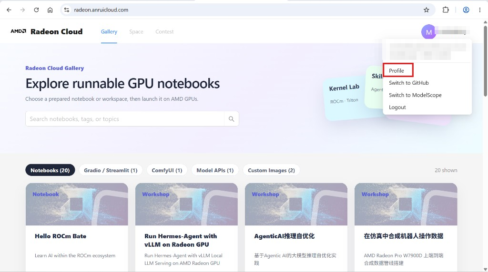
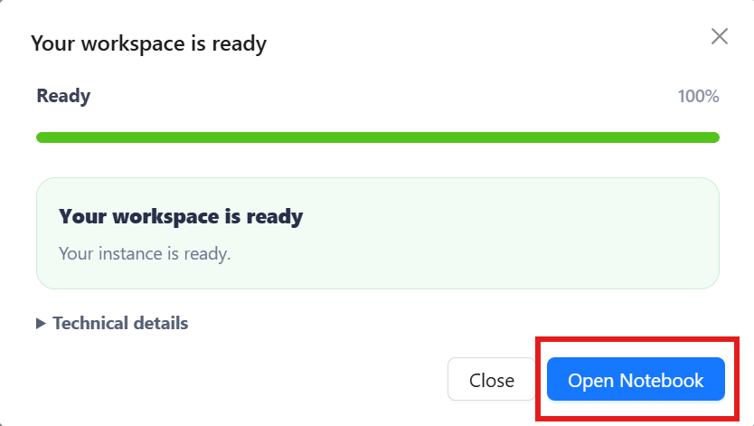
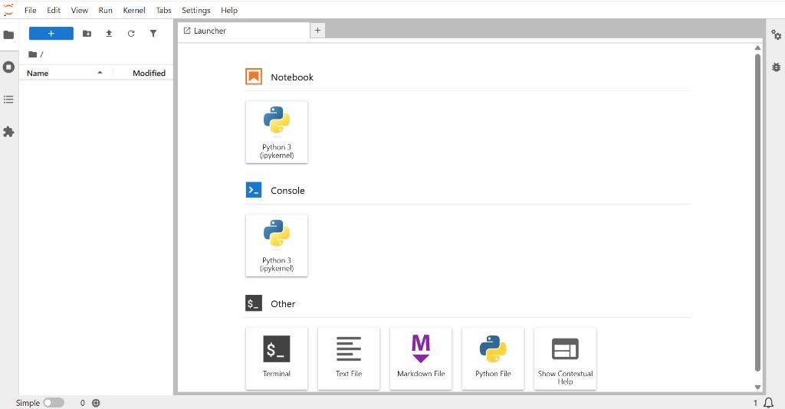
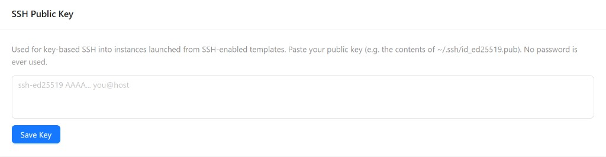
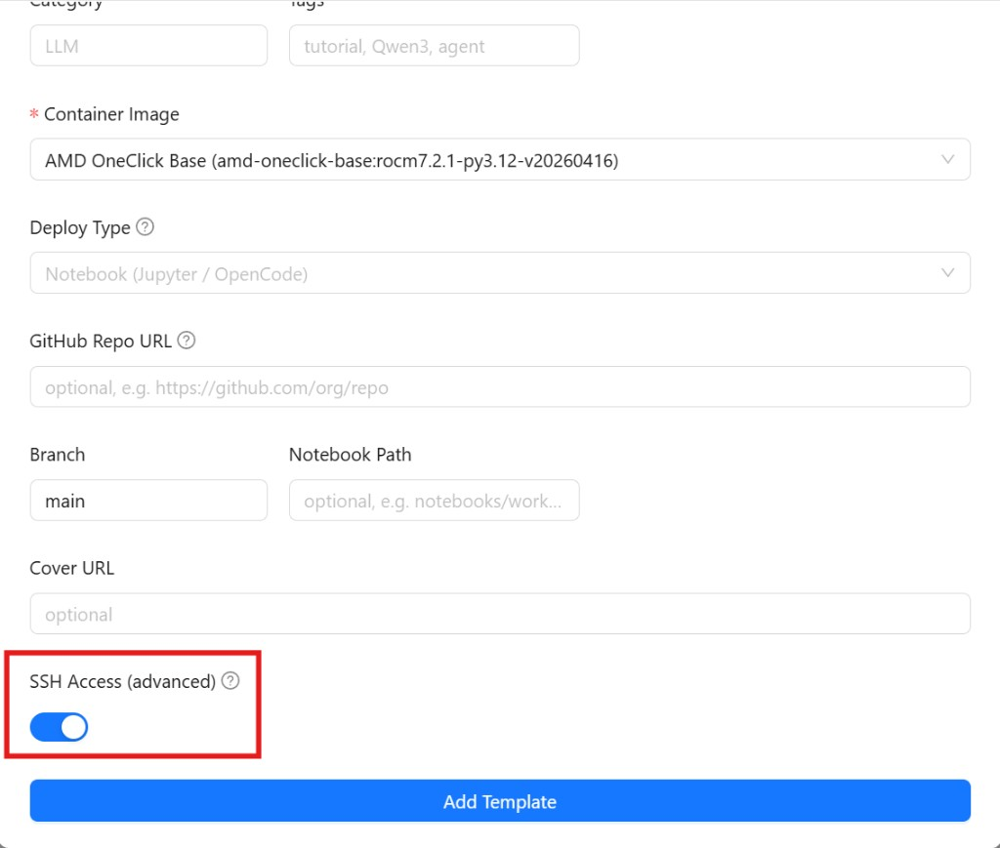
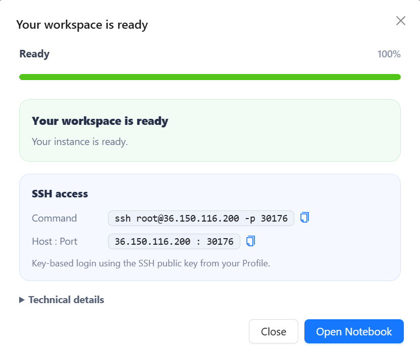
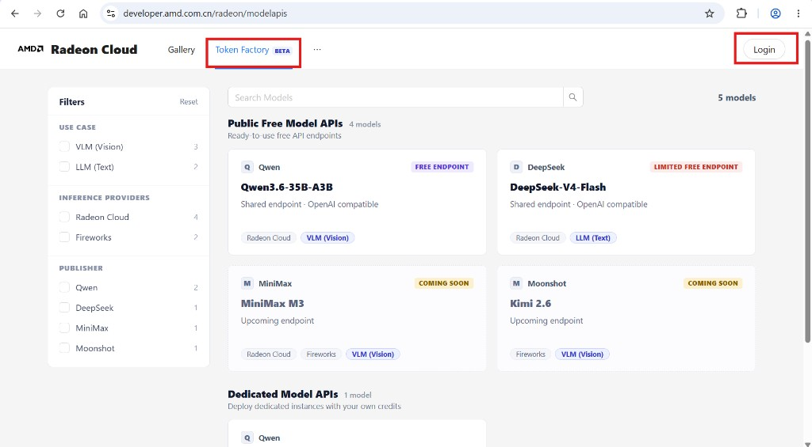
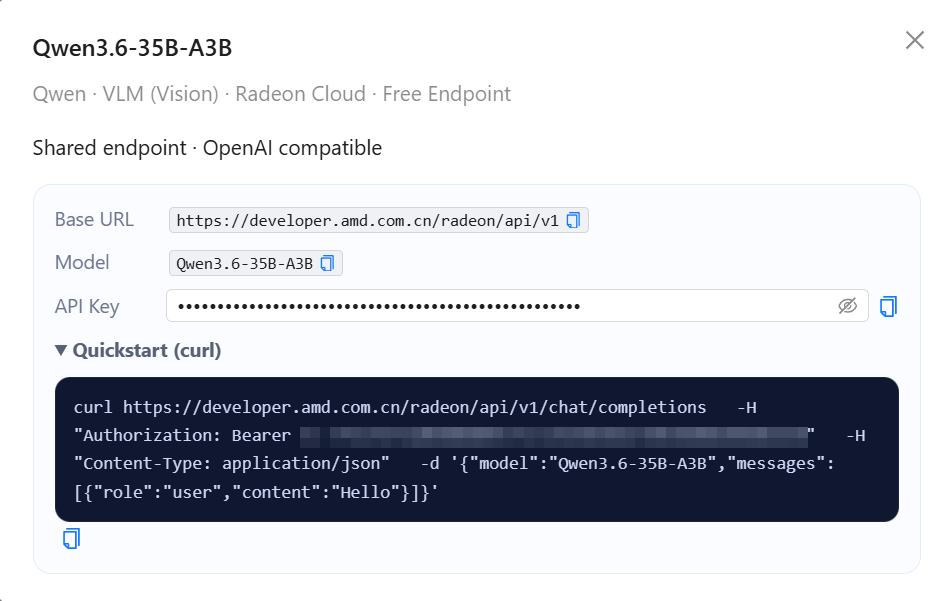

# AMD YES Cloud：Credits 兑换与 Radeon Cloud 使用指南

本指南介绍如何注册并登录 AMD 相关开发者平台、领取算例券、将算例券兑换为 AMD 开发者云 Credits，以及在 Radeon Cloud 中创建并启动自定义 Template。后续章节还包括 JupyterLab、SSH、OpenAI 兼容模型 API、Notebook 公网 Tunnel 和实例销毁等常用操作。

> 建议使用桌面浏览器完成操作。平台页面、可用镜像、模型名称及按钮文案可能随服务更新发生变化，请以实际页面为准。

## 1. 进入活动页面并注册或登录

进入 [AMD AI 开发者计划](https://developer.amd.com.cn/login?source=V3hensKGv)，登录后打开 **我的权益**，找到云算力或算例券相关权益并点击 **兑换**。

初次进入页面时，请按提示完成账号注册、邮箱或手机号验证及登录。


*图 1：AMD AI 开发者计划活动及权益入口*

## 2. 领取并兑换算例券

在活动页面中按照页面提示申请算例券，并将算例券兑换为 AMD 开发者云 Credits。


*图 2：算例券与 AMD 开发者云 Credits 兑换流程*

提交申请后通常需要等待一段时间。原活动流程中约 5 分钟后会在兑换历史中出现 **查看云算力券** 按钮，点击后可查看后续兑换链接；实际到账时间请以页面状态为准。


*图 3：兑换历史中的云算力券入口*

## 3. 登录 Radeon Cloud 并进入 Profile

Credits 到账后，打开 [Radeon Cloud](https://radeon-global.anruicloud.com/)，点击右上角 **Login**，选择 **Login with Email** 并使用对应账号登录。


登录后点击右上角头像，在下拉菜单中选择 **Profile**。



## 4. 创建自定义 Template

在 Profile 页面的 **My Templates** 区域，点击右上角 **Add Template**。


在弹出的表单中完成 Template 配置：

1. 在 **Title** 中填写便于识别的 Template 名称，这是必填项。
2. 在 **Container Image** 中选择需要使用的容器镜像，这是必填项。
3. 如需在实例销毁后保留文件，将 **Storage** 设置为 **Persistent (PVC)**。
4. 如需从本地通过 SSH 连接，在提交前开启 **SSH Access (advanced)**。SSH 的完整配置见第 7 节。
5. 检查配置后，点击表单底部的 **Add Template**。


> 使用临时存储时，请在销毁实例前下载需要保留的代码、模型、日志和输出文件。选择 Persistent (PVC) 后，存储数据可在实例销毁后继续保留。

## 5. 启动 Template

返回 **My Templates** 列表，在刚创建的 Template 所在行点击 **Launch**。


平台随后会创建并初始化实例。启动过程会消耗 Credits，请提前确认余额，避免重复点击 **Launch**。

## 6. 通过 JupyterLab 进入环境

等待进度达到 **100%**，并出现 **Your workspace is ready** 提示后，点击 **Open Notebook**。



浏览器会在新标签页中打开 JupyterLab。你可以使用：

- **Terminal**：在 Launcher 中点击 Terminal，执行 Linux 命令、安装依赖、下载文件或启动服务。
- **Notebook**：打开或运行 `.ipynb` 文件。
- **File Browser**：通过左侧文件浏览器管理文件，并使用上传按钮导入本地文件。



## 7. 通过 SSH 进入环境

如果更习惯本地终端、编辑器或远程开发工具，可以在创建 Template 时启用 SSH。

### 7.1 添加 SSH 公钥

如果本地还没有密钥，可在 macOS、Linux 或 Windows PowerShell 中执行：

```bash
ssh-keygen -t ed25519 -C "your_email@example.com"
```

默认会生成：

- `~/.ssh/id_ed25519`：私钥，仅保存在本地。
- `~/.ssh/id_ed25519.pub`：公钥，可添加到云平台。

复制公钥内容：

```bash
cat ~/.ssh/id_ed25519.pub
```

将公钥粘贴到 Profile 页面的 **SSH Public Key** 输入框，然后点击 **Save Key**。



> 只粘贴以 `.pub` 结尾的公钥内容。不要上传或分享私钥。

### 7.2 为 Template 开启 SSH

创建 Template 时，在表单底部开启 **SSH Access (advanced)**，再点击 **Add Template**。只有从启用了 SSH 的 Template 启动的实例才能通过 SSH 访问。



### 7.3 连接实例

实例就绪后，弹窗及 Profile 页面的 **Active Instance** 区域会显示 SSH 连接信息，包括 Command、Host、Port 和 User。



在本地终端中执行页面提供的命令，或按以下格式连接：

```bash
ssh <user>@<host> -p <port>
```

首次连接时，如终端要求确认主机指纹，请核对连接信息后输入 `yes`。

部分容器镜像可能未默认启动 SSH Server。可以先在 JupyterLab Terminal 中执行：

```bash
sudo apt update
sudo apt install -y openssh-server
mkdir -p /run/sshd
which sshd
/usr/sbin/sshd
```

## 8. 使用 OpenAI 兼容模型 API

Radeon Cloud 还可通过 OpenAI 兼容 HTTP API 提供模型服务，可使用 `curl`、OpenAI SDK、Cherry Studio 或 LangChain 等兼容客户端调用。

### 8.1 公共免费模型 API

公共 API 不需要启动 GPU 实例，也不会消耗实例 Credits。

1. 打开 [Token Factory](https://developer.amd.com.cn/radeon/modelapis) 并登录。
2. 在 **Public Free Model APIs** 中选择模型。
3. 在详情窗口中查看 Base URL、Model、API Key 和 Quickstart。
4. 复制 API Key，并按页面给出的参数发起请求。





下面是参考指南中的 `curl` 调用示例。可用模型及模型名称请以 Token Factory 页面为准。

```bash
curl https://developer.amd.com.cn/radeon/api/v1/chat/completions \
  -H "Authorization: Bearer <API_KEY>" \
  -H "Content-Type: application/json" \
  -d '{
    "model": "Qwen3.6-35B-A3B",
    "messages": [
      {
        "role": "user",
        "content": "Hello"
      }
    ]
  }'
```

### 8.2 专属模型 API

如需部署自己的模型，可创建专属 OpenAI 兼容 API。专属实例会消耗 Credits。

1. 打开 Radeon Cloud，进入 **Profile**，点击 **Add Template**。
2. 将 **Deploy Type** 设置为 **vLLM Model API**。
3. 选择合适的容器镜像，并填写 **Serve Command**。
4. 保留 `--host 0.0.0.0 --port 8000`，平台会将服务路由到 `8000` 端口。
5. 保存 Template，并在 **My Templates** 中点击 **Launch**。

Serve Command 示例：

```bash
vllm serve <model> --host 0.0.0.0 --port 8000
```


实例就绪后，平台会显示专属 Base URL、Model 和 API Key。使用这些信息即可按公共 API 的方式调用服务。

## 9. 将 Notebook 服务暴露到公网

Notebook 内置的 `rc-tunnel` 工具可将 HTTP 或 WebSocket 服务映射到公网 URL。

### 9.1 使用前提

- 该功能仅适用于平台启用此功能后创建的 Notebook；较早创建的 Notebook 需要关闭并重新创建。
- Notebook 内的服务必须监听 `127.0.0.1`。
- 本地端口范围为 `1024-65535`，且不能使用平台保留端口。
- 每个 Notebook Pod 同一时间只能暴露一个端口。
- 公网域名由平台自动分配，格式类似 `rc-<random>.radeon.firstdg.ai`。
- 公网 URL 可被互联网访问。应用必须自行提供登录或其他鉴权，不要直接暴露无鉴权的管理页面。

### 9.2 安装 rc-tunnel

在 Notebook Terminal 中执行：

```bash
/var/run/secrets/frp-self-service/install
```

工具会安装到 `$HOME/.local/bin/rc-tunnel`。当前 Terminal 可使用完整路径；新 Terminal 通常可直接执行 `rc-tunnel version`。

如果当前 Shell 不是 Bash，可先补充 PATH：

```bash
export PATH="$HOME/.local/bin:$PATH"
```

如果身份目录或 `FRP_BROKER_URL` 不存在，通常表示当前 Notebook 创建时间较早。请关闭并重新创建 Notebook，不要自行申请、写入或分享平台密钥。

### 9.3 启动测试服务

下面的示例会在 `127.0.0.1:8081` 启动一个简单 HTTP 页面：

```bash
mkdir -p "$HOME/tunnel-demo"
printf '%s\n' '<!doctype html><title>RC Tunnel</title><h1>RC Tunnel is working</h1>' \
  > "$HOME/tunnel-demo/index.html"
nohup python3 -m http.server 8081 --bind 127.0.0.1 \
  --directory "$HOME/tunnel-demo" \
  > "$HOME/tunnel-demo/http.log" 2>&1 &
curl --fail http://127.0.0.1:8081/
```

### 9.4 暴露、检查和停止服务

暴露本地 `8081` 端口：

```bash
"$HOME/.local/bin/rc-tunnel" expose --port 8081
```

命令会返回平台分配的公网 URL 和 FRPC PID。可以使用以下命令检查状态和日志：

```bash
"$HOME/.local/bin/rc-tunnel" status
"$HOME/.local/bin/rc-tunnel" logs --lines 100
curl --fail http://127.0.0.1:8081/
```

建议按以下顺序排查：

1. 本地 `curl` 失败：应用没有在指定端口监听，与 Tunnel 无关。
2. `status` 显示 FRPC 未运行：检查 `rc-tunnel logs`。
3. 状态正常但公网访问失败：向平台运维提供完整域名、Notebook 创建时间和故障时间，不要发送配置文件或密钥。

停止 Tunnel：

```bash
"$HOME/.local/bin/rc-tunnel" stop
```

停止后公网 URL 会立即失效。Tunnel 不支持 TCP、UDP、SSH、数据库端口或自定义完整域名，也不要手工修改或分享 `~/.local/state/rc-tunnel` 中的配置。

## 10. 使用结束后销毁实例

运行中的实例会持续消耗 Credits。完成开发、训练或部署后：

1. 返回 Radeon Cloud。
2. 点击右上角头像并进入 **Profile**。
3. 在 **Active Instance** 区域找到正在运行的实例。
4. 点击红色 **Destroy Instance** 按钮并确认。
5. 刷新 Profile，确认实例不再处于 Active 或 Running 状态。


> 仅关闭 JupyterLab、Notebook、SSH 会话或浏览器标签页不会停止实例。请主动执行 **Destroy Instance**。

销毁前请确认重要文件已经下载，或已经保存在 Persistent (PVC) 存储中。

## 参考资料

- [AMD 开发者云：兑换 Credits 并启动 LLaMA-Factory](https://github.com/AMD-AIM/AMD_Developers_Notebooks/blob/main/zh/AMD_developer_LLaMAFactory_note_zh.md)
- [Radeon Cloud User Guide](https://github.com/AMD-DEV-CONTEST/Radeon-hackathon-2026-07/blob/main/Radeon-Cloud-User%20Guide/README.md)

