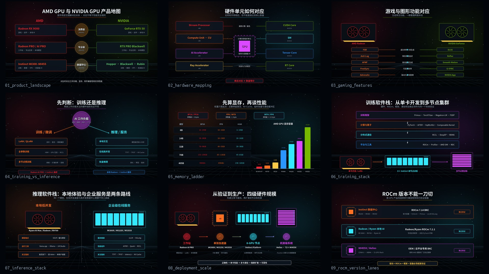
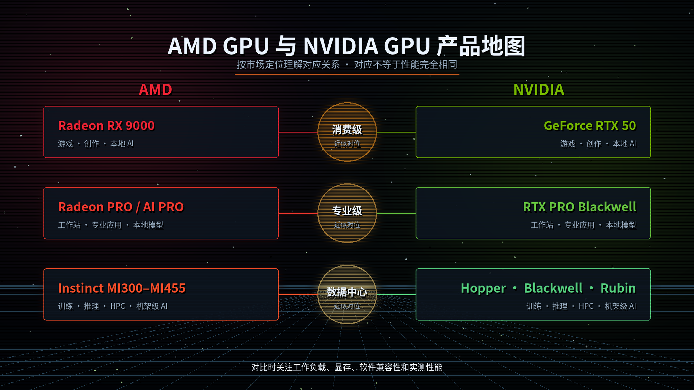
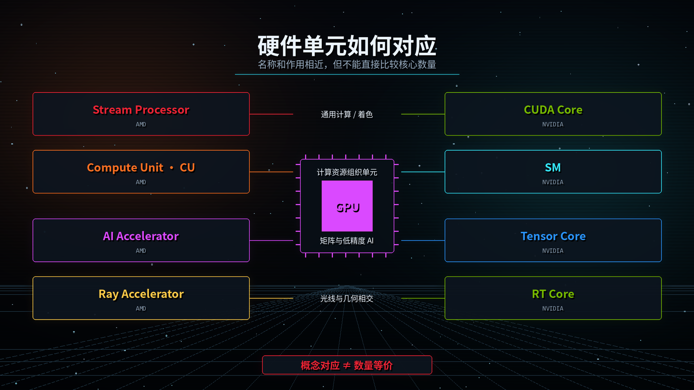
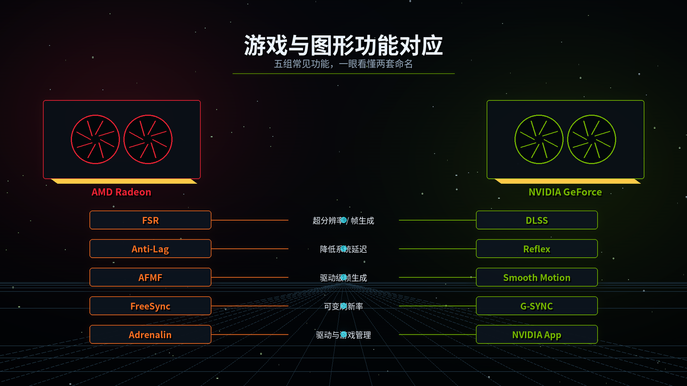
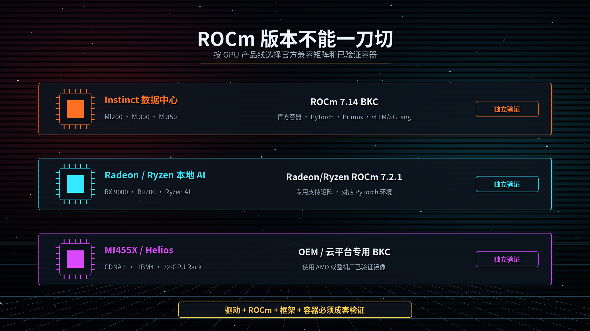
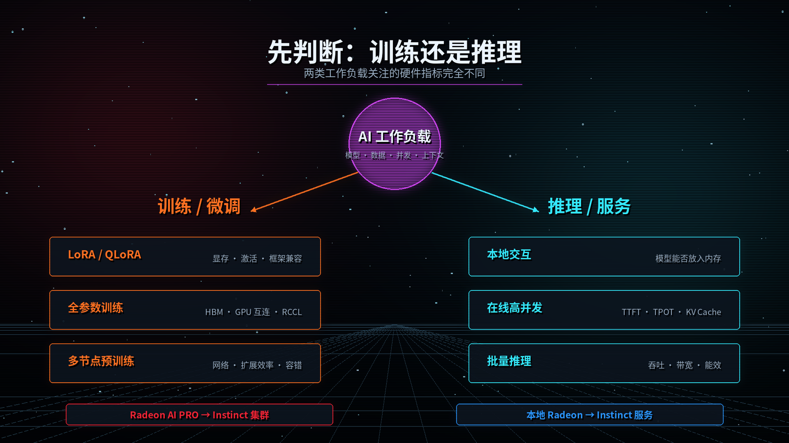
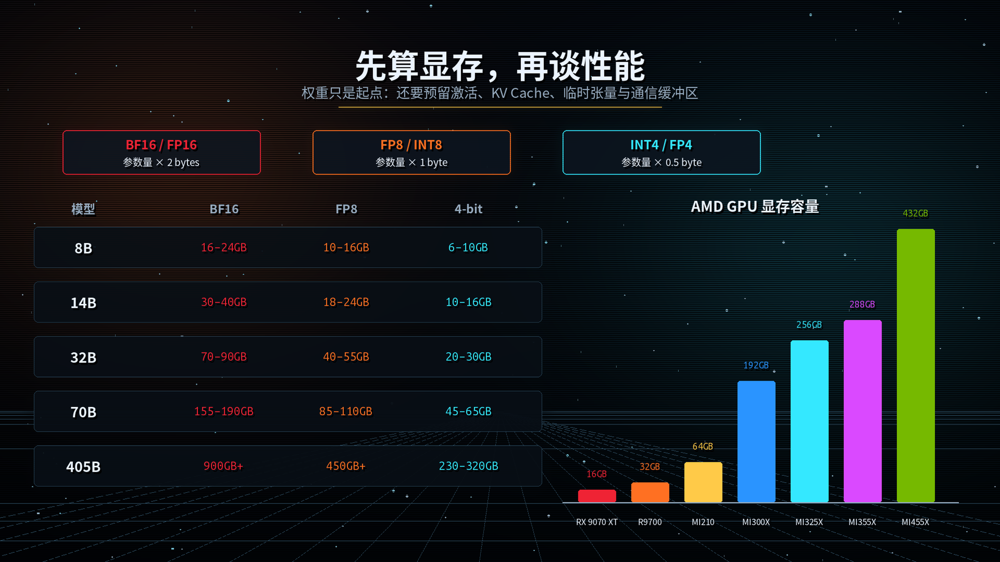
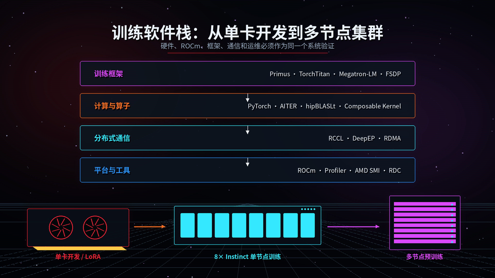
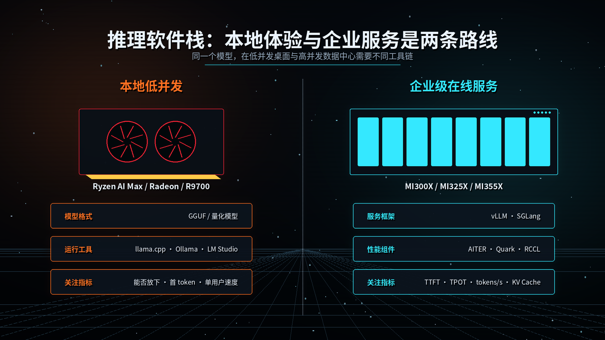
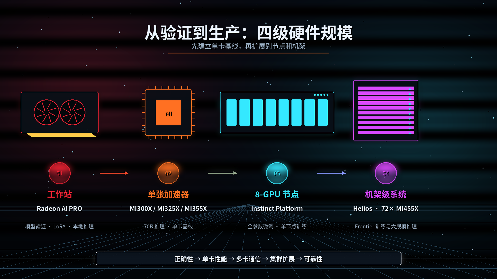

# AMD GPU 与 NVIDIA GPU 产品及功能对应关系

> 更新日期：2026-08-03
>
> 适用场景：GPU 产品科普、技术学习、开发实践、CUDA/ROCm 迁移

## 视频配图预览



9 张 4K 视频配图位于 [`output/gpu_mapping_visuals/`](output/gpu_mapping_visuals/)，推荐镜头顺序和停留时长见 [`VIDEO_VISUALS_CN.md`](VIDEO_VISUALS_CN.md)。

## 1. 先说结论

AMD 和 NVIDIA 的产品、硬件单元与软件功能不存在严格的一一对应关系。本文中的“对应”主要表示：

1. 面向相近的用户或工作负载；
2. 解决相近的问题；
3. 在技术对比中通常会被放在一起讨论。

它不表示两者性能、功耗、兼容性或功能质量完全相同。特别是：

- 不要直接比较 AMD Stream Processor 与 NVIDIA CUDA Core 的数量；
- 不要只看跨架构的理论 TFLOPS；
- 游戏卡必须按具体游戏、分辨率、光追设置和功能开关测试；
- AI/HPC 必须按模型、精度、批量、显存、通信规模和软件版本测试；
- 专业图形必须先确认应用认证、驱动和插件支持。

## 2. 产品家族快速对应

| 使用场景 | AMD 产品家族 | NVIDIA 产品家族 | 对应程度 |
|---|---|---|---|
| 消费级游戏与内容创作 | Radeon RX | GeForce RTX | 高 |
| 专业工作站图形 | Radeon PRO / Radeon AI PRO | NVIDIA RTX PRO，旧称 Quadro、RTX A 系列 | 高 |
| 数据中心 AI 与 HPC | AMD Instinct | NVIDIA Data Center GPU，如 H100/H200、B200/B300、Rubin | 高 |
| 整机 AI 服务器 | Instinct Platform | HGX / DGX | 高 |
| 机架级 AI 系统 | AMD Helios | NVIDIA NVL72 | 高 |
| CPU+GPU 数据中心加速器 | Instinct MI300A | Grace Hopper GH200 等 CPU+GPU Superchip | 中 |
| 集成显卡与 AI PC | Ryzen 处理器内置 Radeon / Ryzen AI | NVIDIA 没有直接对应的 x86 集成 GPU 产品 | 低 |
| 边缘嵌入式 AI | Ryzen Embedded、Versal 等组合 | Jetson | 低，产品形态不同 |

按架构世代可以粗略记为：

| AMD | NVIDIA | 主要市场 |
|---|---|---|
| RDNA 4 / Radeon RX 9000 | Blackwell / GeForce RTX 50 | 游戏、创作、本地 AI |
| RDNA 4 / Radeon AI PRO R9000 | Blackwell / RTX PRO | 工作站、本地 AI、企业可视化 |
| CDNA 5 / Instinct MI400、MI455X | Rubin | 数据中心与机架级 AI |
| CDNA 4 / Instinct MI350、MI355X | Blackwell、Blackwell Ultra | 数据中心 AI/HPC |
| CDNA 3 / Instinct MI300、MI325X | Hopper H100/H200、Grace Hopper | 数据中心 AI/HPC |

常见历史世代的时间线对应如下。这里表示“同一时期的主要产品”，不是性能等价：

| AMD 世代 | NVIDIA 同期世代 | 主要产品示例 |
|---|---|---|
| RDNA 4 | Blackwell | Radeon RX 9000 与 GeForce RTX 50 |
| RDNA 3 | Ada Lovelace | Radeon RX 7000 与 GeForce RTX 40 |
| RDNA 2 | Ampere | Radeon RX 6000 与 GeForce RTX 30 |
| RDNA 1 | Turing | Radeon RX 5000 与 GeForce RTX 20 / GTX 16 |
| Vega / GCN 5 | Pascal 至 Turing 过渡期 | Radeon RX Vega、Radeon VII 与 GeForce GTX 10 / 早期 RTX 20 |
| Polaris / GCN 4 | Pascal | Radeon RX 400/500 与 GeForce GTX 10 |
| CDNA 5 / MI400 | Rubin | MI455X 与 Rubin |
| CDNA 4 / MI350 | Blackwell | MI350X/MI355X 与 B200/B300 |
| CDNA 3 / MI300 | Hopper | MI300X/MI325X 与 H100/H200 |
| CDNA 2 / MI200 | Ampere | MI210/MI250/MI250X 与 A100 |
| CDNA 1 / MI100 | Volta 至 Ampere 过渡期 | MI100 与 V100/A100 时代产品 |



## 3. 消费级游戏卡对位

### 3.1 2026 年主流产品

下表按产品定位和使用场景整理，不代表固定的游戏性能排名。

| AMD Radeon | 最接近的 NVIDIA 产品 | 典型定位 | 说明 |
|---|---|---|---|
| Radeon RX 9070 XT | GeForce RTX 5070 Ti | 高端 1440p、可扩展至 4K | 当前 AMD RX 9000 系列中最接近 RTX 5070 Ti 的产品 |
| Radeon RX 9070 | GeForce RTX 5070 / 5070 Ti | 高端 1440p | 与两档产品存在性能区间重叠，应按具体游戏比较 |
| Radeon RX 9070 GRE | GeForce RTX 5070 | 1440p 高刷新率 | 地区和整机渠道供应可能不同 |
| Radeon RX 9060 XT 16GB | GeForce RTX 5060 Ti 16GB | 主流 1440p、本地 AI 入门 | 显存容量相同，适合放在一起进行应用测试 |
| Radeon RX 9060 XT 8GB | GeForce RTX 5060 Ti 8GB | 1080p 至 1440p | 高画质和 AI 工作负载需要特别关注 8GB 显存限制 |
| Radeon RX 9060 | GeForce RTX 5060 | 主流 1080p | OEM、地区和零售供应情况可能不同 |
| 无同代直接产品 | GeForce RTX 5080 | 4K 高端 | AMD 当前 RX 9000 产品栈没有严格的一对一型号 |
| 无同代直接产品 | GeForce RTX 5090 | 消费级旗舰、创作与本地 AI | AMD 当前没有同级别单卡直接对应产品 |

笔记本 GPU 不建议只按型号数字直接对位。即使名称相近，整机厂设定的功耗范围、散热、显存、MUX、CPU 和内存配置也可能造成很大差异。比较笔记本 GPU 时应查看具体整机型号及其持续功耗，而不是简单套用桌面卡表格。

### 3.2 型号后缀怎么理解

| AMD 命名 | NVIDIA 近似概念 | 含义 |
|---|---|---|
| XT | Ti | 同一型号序列中的增强版，但不是固定等价 |
| XTX | 没有固定后缀对应 | AMD 某些世代的更高阶版本 |
| GRE | 没有固定后缀对应 | 特定规格或市场定位的衍生型号 |
| 无后缀 | 无后缀 | 标准版本 |
| PRO | RTX PRO | 专业产品线，但认证和驱动范围需要单独核对 |

不能根据后缀推导固定比例。例如，“XT = Ti”只能帮助理解产品层级，不能用于推导性能。

## 4. 专业工作站与本地 AI 产品对位

| AMD 产品 | 最接近的 NVIDIA 产品 | 对位依据 | 重要差异 |
|---|---|---|---|
| Radeon AI PRO R9700 32GB | RTX PRO 4500 Blackwell 32GB | 32GB 显存、本地 AI、专业工作站 | CUDA/ROCm、应用认证、功耗和专业功能不同 |
| Radeon AI PRO R9600D 32GB | RTX PRO 4500 Blackwell Server Edition | 32GB、被动散热、多卡和服务器部署 | 机箱风道、驱动和服务器认证必须单独确认 |
| Radeon PRO W7900 48GB | RTX PRO 5000 Blackwell 48GB | 48GB 专业显存、工作站计算与可视化 | 世代、AI 单元、光追和软件生态不同 |
| Radeon PRO W7800 32GB | RTX PRO 4500 Blackwell 32GB | 32GB 专业工作站档位 | 具体 CAD/DCC/渲染器认证可能不同 |
| Radeon PRO W7700 16GB | RTX PRO 4000 Blackwell 24GB | 中高端专业工作站 | 显存容量并不相同，仅是相近市场档位 |
| 无单卡直接对应 | RTX PRO 6000 Blackwell 96GB | 旗舰工作站、本地大模型、超大场景 | AMD 通常需要多张 Radeon AI PRO 或转向 Instinct 平台 |

比较或使用专业卡时，建议按以下顺序判断：

1. 软件厂商是否认证该 GPU 和驱动；
2. 项目是否依赖 CUDA、OptiX、ROCm、HIP 或特定插件；
3. 显存是否能完整容纳模型、场景或数据集；
4. 是否需要 ECC、同步、虚拟化、被动散热或长生命周期驱动；
5. 最后再比较峰值算力、持续性能与能效。

## 5. 数据中心 AI/HPC 产品对位

### 5.1 单 GPU、节点和机架级产品

| AMD | NVIDIA 近似对应 | 对应层级 | 说明 |
|---|---|---|---|
| Instinct MI455X 432GB HBM4 | Rubin GPU 288GB HBM4 | 最新一代数据中心 GPU | 面向大模型训练、推理和微调；精度格式、互连和软件栈不同 |
| AMD Helios，72 张 MI455X | Vera Rubin NVL72 | 机架级 AI 系统 | 都是 72 GPU 级别的机架方案；Helios 采用开放机架和 UALink/UALoE 路线，NVIDIA 采用 NVLink/NVSwitch 路线 |
| Instinct MI355X 288GB HBM3E | Blackwell Ultra B300 288GB HBM3E | 高密度 AI 加速器 | 显存容量相同，但计算格式、互连、功耗和软件成熟度不能直接等同 |
| Instinct MI350X 288GB HBM3E | B200 / B300 | AI/HPC 加速器 | MI350X 与 B300 在显存容量上更接近，与 B200 则属于相近部署世代 |
| 8-GPU MI350/MI355X Platform | HGX B200 / DGX B200、DGX B300 | 8-GPU 节点 | 都提供高速 GPU 互连和统一的软件部署方案 |
| Instinct MI325X 256GB HBM3E | H200 141GB HBM3E | 大显存 AI/HPC | 同属面向大模型和内存密集型负载的加速器，但容量差异明显 |
| Instinct MI300X 192GB HBM3 | H100 / H200 | AI/HPC | 常见于现有云和企业集群的跨厂商技术对比 |
| Instinct MI300A APU | Grace Hopper GH200 | CPU+GPU 超级芯片 | 都强调 CPU 与 GPU 的紧密协同，但内存架构和编程模型不同 |

### 5.2 机架级互连关系

| AMD | NVIDIA | 作用 |
|---|---|---|
| Infinity Fabric | NVLink | GPU 间高带宽互连，具体拓扑和协议不同 |
| UALink | NVLink Scale-up Fabric | 机架内 GPU 扩展互连 |
| UALoE | NVLink/NVSwitch 机架互连体系 | 面向大规模 scale-up 数据传输 |
| Pensando AI NIC / DPU | ConnectX SuperNIC / BlueField DPU | 网络、数据处理和基础设施卸载 |
| Helios | NVL72 | 机架级 AI 基础设施 |

“Helios 对应 NVL72”是系统定位上的对应，不表示两套系统可以直接替换。服务器机柜、电源、液冷、网络、调度、容器镜像和运维工具都需要重新验证。

## 6. GPU 硬件单元对应

| AMD 名称 | NVIDIA 名称 | 主要作用 | 是否可直接比较数量 |
|---|---|---|---|
| Stream Processor | CUDA Core | 通用标量/向量计算与着色 | 否 |
| Compute Unit，CU | Streaming Multiprocessor，SM | GPU 的主要计算资源组织单元 | 否 |
| Wavefront | Warp | 一组并行执行的线程 | 只能比较编程概念，宽度可能不同 |
| AI Accelerator / Matrix Core | Tensor Core | 矩阵运算和低精度 AI 加速 | 否 |
| Ray Accelerator | RT Core | 光线与几何相交等光追加速 | 否 |
| Infinity Cache | 大容量 L2 Cache | 减少外部显存访问、提高有效带宽 | 仅作用近似 |
| HBM/GDDR 显存控制器 | HBM/GDDR 显存控制器 | 连接 GPU 与显存 | 可比较容量和带宽，但还要看访问模式 |
| Video Core Next，VCN | NVENC + NVDEC | 视频编码和解码 | 功能近似，格式和应用支持需逐项核对 |

常见误区：

- 1 个 Stream Processor 不等于 1 个 CUDA Core；
- 1 个 CU 不等于 1 个 SM；
- 1 个 AMD AI Accelerator 不等于 1 个 Tensor Core；
- 不同精度的 TOPS/TFLOPS 不能混在一起比较；
- 稀疏算力不能直接与非稀疏算力比较；
- 消费卡、工作站卡和数据中心卡即使使用相似芯片，也可能有完全不同的驱动、显存和可靠性功能。



## 7. 游戏与图形功能对应

| AMD 功能 | NVIDIA 近似对应 | 用途 | 对应关系说明 |
|---|---|---|---|
| FSR Upscaling | DLSS Super Resolution | 超分辨率重建，提高帧率 | 目标相同，算法、硬件要求和游戏支持不同 |
| FSR Frame Generation | DLSS Frame Generation / Multi Frame Generation | 在渲染帧之间生成额外帧 | DLSS 4.5 在 RTX 50 上支持动态多帧生成；FSR Redstone 提供帧生成组件 |
| FSR Ray Regeneration | DLSS Ray Reconstruction | AI 光追降噪与重建 | 属于最接近的一组功能 |
| FSR Radiance Caching | NVIDIA 神经渲染与路径追踪相关技术 | 加速全局光照或辐射信息估算 | 没有完全同名、完全同边界的一对一功能 |
| Radeon Anti-Lag 2 | NVIDIA Reflex 2 | 降低系统和输入延迟 | 都需要游戏或引擎配合才能发挥完整能力 |
| AMD Fluid Motion Frames，AFMF | NVIDIA Smooth Motion | 驱动级帧生成 | 都可用于没有原生帧生成功能的部分游戏 |
| Radeon Super Resolution，RSR | NVIDIA Image Scaling，NIS | 驱动级空间放大 | 不依赖游戏原生集成，但画质通常受输入分辨率和 UI 缩放影响 |
| Radeon Image Sharpening | NVIDIA Image Scaling Sharpening / Freestyle Sharpening | 图像锐化 | 作用接近 |
| Virtual Super Resolution，VSR | Dynamic Super Resolution，DSR / DLDSR | 高分辨率渲染后缩小输出 | NVIDIA DLDSR 使用 AI 辅助，不能视为完全相同 |
| FreeSync / FreeSync Premium Pro | G-SYNC / G-SYNC Compatible | 可变刷新率，减少撕裂和卡顿 | 显示器认证等级和实现方式不同 |
| Enhanced Sync | Fast Sync | 高帧率场景减少撕裂 | 行为和适用条件不完全相同 |
| Radeon Boost | 无严格一对一功能 | 根据运动动态调整渲染负载 | NVIDIA 可通过其他缩放或优化功能达到部分相近效果 |
| HYPR-RX | NVIDIA App 优化、DLSS Override 等功能组合 | 一键启用多项游戏优化 | 是产品体验层面的近似对应 |
| AMD Noise Suppression | NVIDIA Broadcast Noise Removal | 麦克风和音频降噪 | NVIDIA Broadcast 还包含更多摄像头和虚拟背景功能 |
| AMD Software: Adrenalin Edition | NVIDIA App | 驱动更新、游戏设置、性能监控和录制 | 高度对应 |
| Radeon ReLive / Record & Stream | NVIDIA Overlay / ShadowPlay | 录屏、直播和即时回放 | 功能近似 |
| Eyefinity | NVIDIA Surround | 多显示器拼接输出 | 功能近似 |
| Smart Access Memory | Resizable BAR | 让 CPU 访问更大的 GPU 显存地址空间 | Resizable BAR 是 PCIe 标准能力，不是 AMD 独占技术 |

### 7.1 FSR 与 DLSS 的当前功能边界

截至 2026 年 8 月：

- AMD FSR Redstone SDK 包含 Upscaling、Frame Generation、Ray Regeneration 和 Radiance Caching；
- NVIDIA DLSS 4.5 包含 Super Resolution、Ray Reconstruction、Frame Generation，以及 RTX 50 系列上的 Dynamic Multi Frame Generation；
- “支持 FSR/DLSS”不代表支持整套功能，必须查看具体游戏支持的是哪个组件和版本；
- 驱动级帧生成 AFMF/Smooth Motion 与游戏原生帧生成不是同一种集成方式，延迟、UI 处理和画面稳定性可能不同。



## 8. AI/HPC 软件栈对应

### 8.1 核心平台与开发工具

| AMD ROCm 生态 | NVIDIA CUDA 生态 | 用途 |
|---|---|---|
| ROCm | CUDA Platform / CUDA Toolkit | GPU 计算平台与开发工具总称 |
| HIP | CUDA C++ | GPU 内核编程 API 与语言 |
| `hipcc` / AMD Clang | `nvcc` | GPU 代码编译 |
| HIPIFY | CUDA 到 HIP 的迁移工具 | 辅助转换 CUDA 源代码 |
| ROCm Device Libraries | CUDA Device Libraries | 设备端数学与运行时支持 |
| ROCprofiler / ROCm Compute Profiler / ROCm Systems Profiler | Nsight Compute / Nsight Systems | 性能分析和时间线分析 |
| AMD SMI，旧工具为 ROCm SMI | `nvidia-smi` / DCGM | GPU 监控、管理和健康检查 |
| AMD GPU Operator | NVIDIA GPU Operator | Kubernetes GPU 驱动与组件管理 |

### 8.2 数学、深度学习与通信库

| AMD 库 | NVIDIA 库 | 用途 |
|---|---|---|
| rocBLAS / hipBLAS | cuBLAS | BLAS 线性代数 |
| hipBLASLt | cuBLASLt | 面向矩阵乘法的可调优轻量接口 |
| MIOpen | cuDNN | 深度学习算子与神经网络 primitives |
| RCCL | NCCL | 多 GPU 集合通信 |
| rocFFT | cuFFT | 快速傅里叶变换 |
| rocRAND / hipRAND | cuRAND | 随机数生成 |
| rocSPARSE / hipSPARSE | cuSPARSE | 稀疏矩阵计算 |
| rocSOLVER / hipSOLVER | cuSOLVER | 稠密和稀疏求解器 |
| rocPRIM | CUB | GPU 并行 primitives |
| hipCUB | CUB | CUDA CUB 风格的可移植接口 |
| rocThrust | Thrust | C++ 并行算法 |
| Composable Kernel，CK | CUTLASS | 高性能矩阵与张量算子模板 |
| MIGraphX | TensorRT | 模型图优化与推理 |
| rocDecode / rocJPEG | Video Codec SDK、NVDEC、nvJPEG | 视频和图像解码 |
| AMD AMF | NVIDIA Video Codec SDK | 视频编码、解码和媒体处理 API |

### 8.3 框架层面的对应

PyTorch、TensorFlow、JAX、ONNX Runtime、Triton、vLLM 和 SGLang 等框架可以在不同程度上使用 ROCm 或 CUDA 后端，因此上层 Python 代码可能基本不变，但这不代表可以不经修改直接切换：

- 自定义 CUDA 扩展通常需要 HIP 化、替换或重新编译；
- 算子支持、量化格式、Flash Attention 实现和融合内核可能不同；
- 同一个模型在两套平台上的最优批量、并行策略和环境变量可能不同；
- ROCm 支持的 Radeon、Radeon PRO 和 Instinct 型号范围不同；
- 容器、驱动、内核、固件和框架版本必须遵循官方兼容矩阵。

一句话理解：

> HIP 在编程模型和 API 设计上接近 CUDA，方便移植源码，但 ROCm 不是 CUDA 的二进制兼容层。

## 9. 内容创作与视频功能对应

| AMD | NVIDIA | 说明 |
|---|---|---|
| VCN 硬件编码器 | NVENC | H.264、HEVC、AV1 等格式的硬件编码能力取决于具体 GPU 世代 |
| VCN 硬件解码器 | NVDEC | 硬件视频解码 |
| AMD AMF | NVIDIA Video Codec SDK | 应用调用硬件编解码器的开发接口 |
| Radeon ReLive | NVIDIA Overlay / ShadowPlay | 录屏、直播、即时回放 |
| AMD Noise Suppression | NVIDIA Broadcast | 音频降噪；NVIDIA Broadcast 的摄像头 AI 功能范围更广 |
| Radeon PRO Software | NVIDIA RTX Enterprise Driver | 面向专业应用的驱动分支和稳定性支持 |

视频工作流不能只看“支持 AV1”。还需要确认：

- 编码还是仅解码；
- 8-bit、10-bit 或更高位深；
- 4:2:0、4:2:2、4:4:4 色度格式；
- 同时编码会话数量；
- 剪辑、直播或转码软件是否调用对应硬件路径；
- Linux 与 Windows 下的驱动和 API 支持是否一致。

## 10. 如何根据训练、微调和推理选择 AMD GPU 与 ROCm 组合

### 10.1 当前软件版本基线

截至 2026 年 8 月 3 日：

- Instinct/HPC 主线的最新 ROCm 生产版本为 ROCm 7.14.0，发布日期为 2026 年 7 月 15 日；
- ROCm 7.9 至 7.13 属于预览版本序列，ROCm 7.14 开始恢复生产版本；
- 官方 ROCm 7.14 PyTorch 容器提供 PyTorch 2.10、2.11 和 2.12；
- ROCm 7.14 通用兼容矩阵列出了 MI350X、MI355X、MI325X、MI300X、MI300A 和 MI200 系列等 Instinct 产品；
- Radeon/Ryzen 本地 AI 使用独立的产品支持与发布页面，当前文档标注为 ROCm 7.2.1，覆盖 Radeon RX 9000、部分 RX 7000、Radeon PRO/Radeon AI PRO 和部分 Ryzen APU；
- MI455X 于 2026 年 7 月 23 日发布，当前没有列入 ROCm 7.14 通用兼容矩阵。部署 MI455X/Helios 时应使用 AMD、云服务商或整机厂提供的已验证软件镜像和 Best Known Configuration，不应自行假设通用 ROCm 7.14 安装已经覆盖全部功能。

因此，不能简单地把“最新 ROCm 7.14”安装到所有 AMD GPU。应分别使用：

- **Instinct 数据中心 GPU**：ROCm 7.14 BKC 和对应的官方容器；
- **Radeon、Radeon PRO、Radeon AI PRO、Ryzen APU**：专用 Radeon/Ryzen 兼容矩阵推荐的 ROCm 版本，当前为 7.2.1；
- **MI455X/Helios**：整机厂、云平台或 AMD 提供的 MI455X 专用验证镜像。

生产环境建议把以下四项作为一个不可拆分的版本组合：

1. GPU 固件；
2. `amdgpu` 内核驱动；
3. ROCm 用户态组件；
4. PyTorch、vLLM、SGLang、Primus 等应用容器。

不要只升级其中一项。数据中心服务器应优先采用整机厂 BKC 或 AMD 官方容器，而不是在宿主机上自由组合不同发布日期的软件包。



### 10.2 先判断是训练还是推理

| 工作负载 | 最重要的硬件指标 | 次要指标 | 首选 AMD 产品形态 |
|---|---|---|---|
| 本地交互式推理 | 可用显存/统一内存、内存带宽 | 功耗、噪声、桌面软件易用性 | Ryzen AI Max、Radeon AI PRO |
| 单机批量推理 | HBM 容量和带宽、低精度吞吐 | PCIe、CPU、存储读入速度 | Instinct MI300X/MI325X/MI350X/MI355X |
| 在线高并发推理 | decode 吞吐、KV Cache 容量、节点内互连 | 网络、调度、连续批处理能力 | MI325X、MI350X、MI355X |
| LoRA/QLoRA 微调 | 显存、激活内存、框架兼容性 | 单卡算力、数据加载速度 | Radeon AI PRO 或 Instinct |
| 全参数微调 | HBM 容量、GPU 互连、通信带宽 | 检查点存储和网络 | 8-GPU Instinct 节点 |
| 从零预训练 | 多节点扩展效率、可靠性、网络 | 单卡峰值算力、存储吞吐 | MI355X 集群或已验证的 MI455X/Helios |
| HPC/科学计算 | FP64、内存带宽、MPI/通信 | 软件移植和数值验证 | Instinct MI300A/MI300X/MI350/MI430X |

训练和推理不能使用同一套简单排名：

- 训练通常是计算和通信密集型，需要存储权重、梯度、优化器状态和激活；
- 推理通常更受权重、KV Cache、批量和内存带宽影响；
- prefill 阶段偏计算密集，decode 阶段通常更偏内存带宽和延迟；
- MoE 模型还要考虑专家并行和 all-to-all 通信；
- 长上下文会显著增加 KV Cache，即使模型权重可以放入显存，也可能在实际服务时 OOM。



### 10.3 用显存先筛掉不合适的方案

仅估算 LLM 权重时，可以使用：

```text
BF16/FP16 权重约占：参数量 × 2 bytes
FP8/INT8 权重约占：参数量 × 1 byte
INT4/FP4 权重约占：参数量 × 0.5 byte
```

例如，70B 模型的 BF16 权重约为 140GB，但真正运行时还需要框架、临时张量、通信缓冲区和 KV Cache，因此不能把 140GB 模型直接部署到仅有 140GB 显存的 GPU 上。

以下是用于初步估算的总显存起点，不是精确保证：

| 模型规模 | BF16/FP16 推理 | FP8/INT8 推理 | INT4/FP4 推理 | 适合的 AMD 硬件起点 |
|---|---:|---:|---:|---|
| 7B/8B | 16-24GB | 10-16GB | 6-10GB | RX 9000、Radeon AI PRO、Ryzen AI Max |
| 13B/14B | 30-40GB | 18-24GB | 10-16GB | Radeon AI PRO 32GB 或更高 |
| 30B/32B | 70-90GB | 40-55GB | 20-30GB | Ryzen AI Max 大内存系统、MI210 64GB 或 Instinct |
| 70B/72B | 155-190GB | 85-110GB | 45-65GB | MI300X 192GB、MI325X 256GB、MI350/MI355X 288GB |
| 400B/405B | 900GB 以上 | 450GB 以上 | 230-320GB | 多张 MI300/MI350，或经过验证的 MI455X 量化方案 |

这些范围已预留部分运行时开销，但没有完整覆盖超长上下文和高并发 KV Cache。在线服务应额外根据下面的变量压测：

- 最大上下文长度；
- 最大并发请求数；
- 平均输入和输出 token 数；
- KV Cache 精度；
- Tensor Parallel 和 Pipeline Parallel 规模；
- vLLM/SGLang 的 `gpu-memory-utilization`、最大序列数和调度策略。

全参数训练比推理占用更多内存。以 Adam 类优化器为例，仅权重、梯度、主权重和优化器状态通常就需要约 12-16 bytes/parameter，此外还有激活、临时工作区和通信缓冲区。70B 模型全参数训练不能仅根据 140GB BF16 权重选择单卡。

LoRA/QLoRA 会显著减少可训练参数和优化器状态，但基础模型权重、激活和上下文仍然占用内存。长上下文或大 micro-batch 下，激活可能成为主要瓶颈。



### 10.4 AMD 硬件选择参考

| 目标用途 | 推荐硬件 | 推荐理由 | 不适合的情况 |
|---|---|---|---|
| 7B-14B 本地推理 | RX 9070 XT 16GB 或 Radeon AI PRO R9700 32GB | 桌面部署方便；32GB 对本地 AI 更从容 | 高并发服务、70B BF16、正式多机训练 |
| 14B-32B 本地推理和开发 | Radeon AI PRO R9700 32GB | 32GB 独立显存、RDNA 4、适合 PyTorch 开发和量化模型 | 大规模 RCCL 训练、需要 HBM 带宽 |
| 大模型本地低并发推理 | Ryzen AI Max+ 395 等大统一内存系统 | 可配置较大的 GPU 可访问统一内存，适合大于普通消费卡显存的量化模型 | 不能把共享 LPDDR 带宽等同于 Instinct HBM；不适合高吞吐数据中心服务 |
| 7B-14B LoRA/QLoRA | Radeon AI PRO 32GB | 适合开发、验证和单机微调 | 全参数训练、大 batch、超长上下文 |
| 密集型 PCIe 服务器推理 | Radeon AI PRO R9600D 32GB | 被动散热、双槽、多卡服务器部署 | 必须使用具备正确风道的服务器，不适合普通桌面机箱 |
| 32B-70B 量化推理 | MI210 64GB、MI300X 192GB 或更新 Instinct | 显存容量明显高于桌面卡 | MI210 属于较老平台，应关注能效和软件生命周期 |
| 70B BF16/FP8 单卡推理 | MI300X 192GB、MI325X 256GB、MI350/MI355X 288GB | 单卡可容纳模型和较大的运行时空间 | 超高并发和超长上下文仍可能需要多卡 |
| 内存密集型推理 | MI325X 256GB | 大 HBM 容量，适合大模型、较长上下文和较大 KV Cache | 需要最新 MXFP4/MXFP6 吞吐时优先评估 MI350/MI355X |
| 高吞吐推理 | MI355X 288GB | CDNA 4、288GB HBM3E、支持扩展低精度格式，适合 vLLM/SGLang | 对低并发桌面场景而言配置过重 |
| 单节点训练和全参数微调 | 8× MI300X、MI325X 或 MI355X | 节点内高速互连和 RCCL，更适合 FSDP、TP、PP、EP | 不应使用普通 PCIe 桌面卡替代同类训练节点 |
| 多节点大模型预训练 | MI355X 集群 | ROCm 7.14、Primus、TorchTitan/Megatron-LM 和多节点工具链较完整 | 需要先验证网络、RCCL、容错和检查点系统 |
| Frontier 训练/推理 | MI455X/Helios | 432GB HBM4 单 GPU、72-GPU 机架级系统 | 当前应按 OEM/云平台 BKC 部署，不建议自行拼装通用软件栈 |

### 10.5 训练场景的软件组合

#### A. 单卡开发、LoRA 和 QLoRA

推荐组合：

```text
Radeon AI PRO R9700 或单张 Instinct
  + Linux
  + 与目标 GPU 对应的官方 ROCm 版本
  + 官方 PyTorch ROCm 容器
  + Transformers
  + PEFT
  + Llama-Factory / torchtune / Unsloth
  + ROCm 兼容的 QLoRA 后端
```

适合：

- 7B/8B 模型 SFT、LoRA、QLoRA；
- 14B 模型的低 batch 微调；
- 算子兼容性验证；
- 在进入昂贵的 Instinct 集群前调试数据和训练脚本。

使用 bitsandbytes 等 QLoRA 后端前，应确认目标 GPU、ROCm 和 PyTorch 版本已经通过验证。AMD Quark 主要用于模型量化、校准和推理部署，不是 PEFT/QLoRA 训练框架的替代品。

Radeon AI PRO 应跟随 Radeon/Ryzen 支持页面当前推荐的 ROCm 7.2.1；Instinct 应跟随 ROCm 7.14 BKC。不要为了让两台机器“版本看起来一致”而强制安装同一个 ROCm 软件仓库。

建议优先使用 Linux。虽然 ROCm 支持 Windows 和 WSL 的部分场景，但生产训练容器、多 GPU 通信和多数高性能训练配方以 Linux 为主。

#### B. 单节点多 GPU 训练

推荐组合：

```text
8× MI300X / MI325X / MI350X / MI355X
  + 整机厂验证的 Linux、驱动和固件
  + ROCm 7.14 官方/BKC 容器
  + PyTorch
  + Primus
  + TorchTitan 或 Megatron-LM 后端
  + RCCL
  + Primus-Turbo / AITER / hipBLASLt / Composable Kernel
  + ROCm Compute Profiler + ROCm Systems Profiler
  + AMD SMI / RDC
```

选择后端时：

- 已有 Megatron-LM 配置、TP/PP/EP 经验时，使用 Primus-Megatron；
- 希望跟随 PyTorch 原生分布式和 TorchTitan 生态时，使用 Primus-TorchTitan；
- 普通视觉、语音或自定义 PyTorch 模型可以直接使用 DDP/FSDP，不一定需要 Primus；
- JAX/MaxText 项目应使用 ROCm 验证过的 JAX/XLA 版本，并针对 MoE 评估 Primus-Turbo 的 grouped GEMM 和 DeepEP 路径。

#### C. 多节点预训练

除了单节点软件，还需要：

| 层级 | 推荐组件 |
|---|---|
| 训练框架 | Primus + Megatron-LM/TorchTitan，或验证过的 JAX/MaxText |
| GPU 通信 | RCCL；MoE 场景评估 DeepEP |
| 网络 | 与 BKC 一致的 InfiniBand 或 RoCE，正确配置 RDMA、PFC/DCQCN、MTU 和 GID |
| 调度 | Slurm 或 Kubernetes |
| Kubernetes GPU 管理 | AMD GPU Operator |
| 健康检查 | ROCm Validation Suite、Primus Preflight、TransferBench、RCCL 测试 |
| 监控 | AMD SMI、RDC、Prometheus/Grafana |
| 性能分析 | ROCm Systems Profiler、ROCm Compute Profiler、PyTorch Profiler |
| 稳定性与容错 | 检查点系统；大集群可评估 Primus-SaFE |

多节点训练必须先验收以下指标，再启动正式训练：

1. 每张 GPU 的 GEMM 和 HBM 带宽没有异常离群点；
2. 节点内 GPU 互连带宽符合整机基线；
3. 节点间 RDMA 带宽和延迟稳定；
4. RCCL all-reduce 和 all-to-all 扩展效率正常；
5. 长时间压力测试没有 XGMI、PCIe、ECC、温度或电源异常；
6. 检查点写入和恢复时间满足作业容错目标。



### 10.6 推理场景的软件组合

#### A. 本地低并发推理

推荐组合：

```text
Ryzen AI Max / Radeon RX / Radeon AI PRO
  + ROCm 支持的 Linux 或 Windows 环境
  + llama.cpp / Ollama / LM Studio
  + GGUF 量化模型
```

适合个人助手、RAG 原型、代码助手、离线应用和模型功能验证。需要自定义 PyTorch 模型时，再使用 ROCm + PyTorch + Transformers。

这类方案优先追求：

- 模型能否完整放入显存或统一内存；
- 首 token 延迟；
- 单用户 tokens/s；
- 安装和模型管理是否方便。

它不适合用来预测数据中心高并发 vLLM 服务的性能。

#### B. 企业级在线 LLM 服务

推荐组合：

```text
MI300X / MI325X / MI350X / MI355X
  + ROCm 7.14 BKC
  + 官方 vLLM 或 SGLang ROCm 容器
  + AITER
  + RCCL
  + AMD Quark 量化模型
  + AMD SMI / RDC
  + ROCm Profiler
```

框架选择：

| 需求 | 首选软件 |
|---|---|
| OpenAI 兼容 API、连续批处理、通用高吞吐服务 | vLLM |
| 复杂生成流程、RadixAttention、PD 分离或高级服务调度 | SGLang |
| 本地简单部署和 GGUF 量化 | llama.cpp / Ollama / LM Studio |
| ONNX、固定计算图、CV/传统模型 | ONNX Runtime ROCm EP 或 MIGraphX |
| 模型量化 | AMD Quark |
| ROCm 优化融合算子 | AITER |
| 多 GPU 通信 | RCCL |

vLLM 和 SGLang 的优化容器主要面向 Instinct。Radeon 上即使框架可以启动，也不应默认获得与 MI300/MI350 相同的算子覆盖和性能。

#### C. 分布式推理

模型放不进单张 GPU，或者单机吞吐不足时，再增加：

- Tensor Parallel：拆分单层权重，适合单个大模型；
- Pipeline Parallel：按层拆分，需关注流水线气泡；
- Data Parallel：复制模型提高并发吞吐；
- Expert Parallel：用于 MoE 专家拆分；
- Prefill-Decode Disaggregation：将 prefill 与 decode 分配到不同资源池；
- MoRI/RDMA：在 MI355X 多节点场景优化分布式推理通信。

先使用单 GPU 建立正确性和性能基线，再扩展到单节点多 GPU，最后扩展到多节点。直接从多节点开始，难以区分模型、算子、RCCL 和网络问题。



### 10.7 典型开发与部署组合

| 需求 | 建议组合 |
|---|---|
| 本地运行 7B/8B BF16 | 16-32GB Radeon + ROCm/PyTorch，或 Ollama/llama.cpp |
| 本地运行 32B 4-bit | Radeon AI PRO 32GB，或大统一内存 Ryzen AI Max + Ollama/llama.cpp |
| 本地 QLoRA 微调 7B/8B | Radeon AI PRO 32GB + Radeon/Ryzen 当前支持的 ROCm 版本 + PyTorch + PEFT/Llama-Factory |
| 企业部署 70B BF16 | 1× MI300X/MI325X/MI355X + vLLM/SGLang；按上下文和并发保留 KV Cache 空间 |
| 企业部署 70B FP8 | MI300X 及以上 + Quark FP8 + vLLM + AITER |
| 部署 405B 4-bit/FP8 | 多张 MI300/MI350；单 MI455X 方案必须以已验证容器和实测内存为准 |
| 70B 全参数训练 | 8-GPU Instinct 节点起步 + Primus + TorchTitan/Megatron-LM + RCCL |
| 405B 或大型 MoE 训练 | 多节点 MI355X，或 Helios/MI455X 已验证平台 + Primus/相应 BKC |
| CV/语音模型训练 | Instinct + ROCm PyTorch + MIOpen；小模型开发可用 Radeon AI PRO |
| ONNX 企业推理 | Instinct/Radeon PRO + ONNX Runtime ROCm EP 或 MIGraphX |



### 10.8 最终决策流程

1. **确认软件能运行**：检查 GPU、操作系统、驱动、ROCm、框架和模型算子是否在官方支持范围；
2. **确认模型能放下**：计算权重、激活、优化器、KV Cache 和临时缓冲区；
3. **确认单卡性能**：分别测试训练 tokens/GPU/s，或推理 TTFT、TPOT、tokens/s；
4. **确认多卡通信**：测试 RCCL 和节点内互连，不要只测试理论带宽；
5. **确认集群网络**：多节点测试 all-reduce、all-to-all 和真实模型扩展效率；
6. **确认可靠性**：运行长时间压力测试、ECC/链路监控和检查点恢复；
7. **观察整体效率**：比较吞吐、延迟、每瓦性能、机架密度和工程维护复杂度。

### 10.9 哪些情况下优先选择 NVIDIA

即使 AMD 硬件显存或开放软件栈更合适，出现以下条件时仍应优先评估 NVIDIA：

- 项目依赖没有 ROCm/HIP 实现的自定义 CUDA 扩展；
- 关键商业软件只认证 CUDA、TensorRT 或 OptiX；
- 团队没有时间进行 HIP 移植、算子替换和性能调优；
- 模型所需量化格式或推理后端尚未在目标 AMD GPU 上验证；
- 项目规模较小，而现成 CUDA 镜像、教程和运维经验可以显著降低开发门槛。

### 10.10 哪些情况下 AMD 更有吸引力

- 模型受显存容量或 HBM 带宽限制；
- 项目已经使用 PyTorch、vLLM、SGLang、ONNX Runtime 等具备 ROCm 路径的开源框架；
- 希望使用 HIP、开放组件和可定制的软件栈；
- 需要 MI325X/MI350/MI355X 的大 HBM 容量；
- 有能力使用官方容器和 BKC，并执行模型级性能验收；
- 关注完整节点或机架系统的协同能力，而不是只比较单张 GPU。

## 11. 最简版记忆表

| NVIDIA | AMD |
|---|---|
| GeForce RTX | Radeon RX |
| RTX PRO | Radeon PRO / Radeon AI PRO |
| H100/H200、B200/B300、Rubin | MI300/MI325、MI350/MI355、MI455 |
| CUDA | ROCm |
| CUDA C++ | HIP |
| CUDA Core | Stream Processor |
| SM | CU |
| Tensor Core | AI Accelerator / Matrix Core |
| RT Core | Ray Accelerator |
| DLSS | FSR |
| Reflex | Anti-Lag |
| Smooth Motion | AFMF |
| G-SYNC | FreeSync |
| NVENC/NVDEC | VCN |
| NVLink/NVSwitch | Infinity Fabric / UALink / UALoE |
| cuBLAS | rocBLAS |
| cuDNN | MIOpen |
| NCCL | RCCL |
| TensorRT | MIGraphX |
| Nsight | ROCm Profiler 工具 |
| `nvidia-smi` / DCGM | AMD SMI |

## 12. 官方资料

以下链接用于核对当前产品和功能。型号、驱动和软件支持会持续更新，实际测试或部署前应再次查看官方页面。

### 产品

- [AMD Radeon RX Graphics](https://www.amd.com/en/products/graphics/desktops/radeon.html)
- [NVIDIA GeForce RTX 50 Series](https://www.nvidia.com/en-us/geforce/graphics-cards/50-series/)
- [AMD Radeon AI PRO R9700](https://www.amd.com/en/products/graphics/workstations/radeon-ai-pro/ai-9000-series/amd-radeon-ai-pro-r9700.html)
- [AMD Radeon AI PRO R9600D](https://www.amd.com/en/products/graphics/workstations/radeon-ai-pro/ai-9000-series/amd-radeon-ai-pro-r9600d.html)
- [NVIDIA RTX PRO 4500 Blackwell](https://www.nvidia.com/en-us/products/workstations/professional-desktop-gpus/rtx-pro-4500/)
- [NVIDIA RTX PRO 6000 Blackwell](https://www.nvidia.com/en-us/products/workstations/professional-desktop-gpus/rtx-pro-6000/)
- [AMD Instinct MI455X](https://www.amd.com/en/products/accelerators/instinct/mi400/mi455x.html)
- [AMD Helios](https://www.amd.com/en/products/rackscale-solutions/helios.html)
- [NVIDIA Vera Rubin](https://www.nvidia.com/en-us/data-center/technologies/rubin/)
- [NVIDIA Vera Rubin NVL72](https://www.nvidia.com/en-us/data-center/vera-rubin-nvl72/)
- [AMD Instinct MI350 Series](https://www.amd.com/en/products/accelerators/instinct/mi350.html)
- [NVIDIA DGX B300](https://www.nvidia.com/en-us/data-center/dgx-b300/)
- [NVIDIA DGX B200](https://www.nvidia.com/en-us/data-center/dgx-b200/)

### 游戏与图形技术

- [AMD FSR SDK](https://gpuopen.com/amd-fsr-sdk/)
- [NVIDIA DLSS](https://developer.nvidia.com/rtx/dlss)
- [AMD Radeon Anti-Lag](https://www.amd.com/en/products/software/adrenalin/radeon-software-anti-lag.html)
- [NVIDIA Reflex](https://www.nvidia.com/en-us/geforce/technologies/reflex/)
- [AMD Fluid Motion Frames](https://www.amd.com/en/products/software/adrenalin/afmf.html)
- [NVIDIA Smooth Motion](https://www.nvidia.com/en-us/geforce/news/nvidia-app-global-dlss-overrides-rtx-40-series-smooth-motion/)
- [AMD FreeSync](https://www.amd.com/en/products/graphics/technologies/freesync.html)
- [NVIDIA G-SYNC](https://www.nvidia.com/en-us/geforce/products/g-sync-monitors/)

### 计算软件

- [AMD ROCm Documentation](https://rocm.docs.amd.com/en/latest/)
- [ROCm Release History](https://rocm.docs.amd.com/en/latest/release/versions.html)
- [ROCm Compatibility Matrix](https://rocm.docs.amd.com/en/latest/compatibility/compatibility-matrix.html)
- [ROCm on Radeon and Ryzen Compatibility](https://rocm.docs.amd.com/projects/radeon-ryzen/en/latest/docs/compatibility/compatibility.html)
- [AMD HIP Documentation](https://rocm.docs.amd.com/projects/HIP/en/latest/)
- [AMD HIP Porting Guide](https://rocm.docs.amd.com/projects/HIP/en/latest/how-to/hip_porting_guide.html)
- [AMD AI Developer Hub](https://rocm.docs.amd.com/projects/ai-developer-hub/en/latest/)
- [Install PyTorch for ROCm](https://rocm.docs.amd.com/projects/install-on-linux/en/latest/install/3rd-party/pytorch-install.html)
- [AMD Primus](https://github.com/AMD-AGI/Primus)
- [AMD Quark Documentation](https://quark.docs.amd.com/latest/)
- [AMD AITER](https://github.com/ROCm/aiter)
- [NVIDIA CUDA Documentation](https://docs.nvidia.com/cuda/)
- [AMD ROCm Libraries](https://rocm.docs.amd.com/en/latest/reference/api-libraries.html)
- [NVIDIA CUDA Libraries](https://docs.nvidia.com/cuda/doc/index.html)
