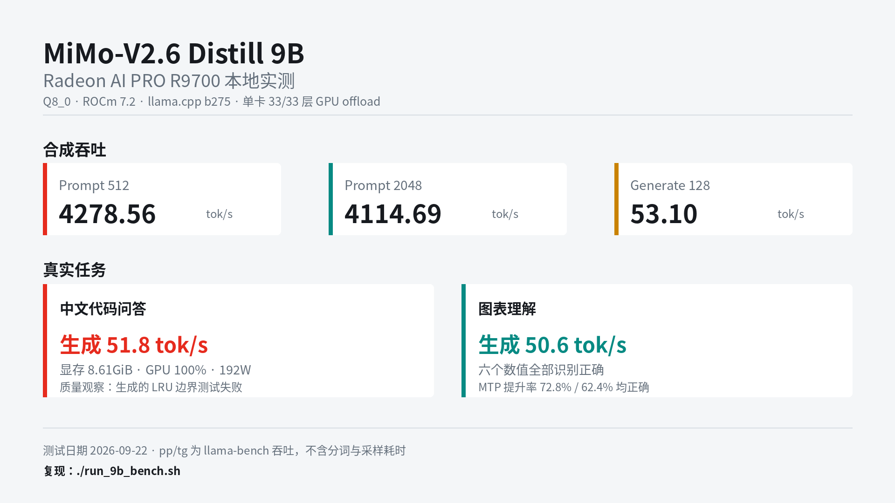

# MiMo-V2.6 Distill 9B：AMD Radeon AI PRO R9700 本地实测

本目录只记录 `XiaomiMiMo/MiMo-V2.6-Distill-Qwen-9B` 的单卡 AMD GPU
测试。测试日期为 **2026-09-22**。

## 结论

- MiMo-V2.6 Distill 9B 的 Q8_0 GGUF 可在单张 32GB R9700 上完整加载。
- 33/33 层全部卸载到 GPU，8K 上下文真实对话约占 8.61GiB 显存。
- 最优合成测试结果：

| 项目 | 吞吐 |
| --- | ---: |
| `pp512` | **4278.56 +/- 75.81 tok/s** |
| `pp2048` | **4114.69 +/- 5.58 tok/s** |
| `tg128` | **53.10 +/- 0.05 tok/s** |

- 中文代码问答生成速度为 **51.8 tok/s**。
- 图表理解生成速度为 **50.6 tok/s**，图中六个数值和两组提升率均识别正确。
- 代码回答存在一个可复现的 LRU 逻辑错误，说明小模型输出仍需测试验证。

`pp` 表示 prompt processing，`tg` 表示 token generation。`llama-bench`
不包含分词和采样耗时，因此合成结果不能直接等同于端到端应用吞吐。

结果图：



## 测试环境

| 项目 | 配置 |
| --- | --- |
| 操作系统 | Ubuntu 24.04.3 LTS |
| Linux 内核 | `7.0.0-31-generic` |
| CPU | AMD Ryzen Threadripper PRO 9995WX，96 核 192 线程 |
| 内存 | 502GiB |
| GPU | AMD Radeon AI PRO R9700 32GB，单卡测试 |
| GPU 架构 | `gfx1201` |
| ROCm 运行时 | 7.2.0 |
| llama.cpp | `0eadefebd3f8f92a86d634a0e5b8fffc9dc792c0` |
| llama.cpp build | `0.3.0-dev`，build 275 |
| 编译器 | GNU 13.3.0 |

实测时通过 `ROCR_VISIBLE_DEVICES` 选择一张空闲 R9700。该编号属于
HIP/HSA 枚举，不一定与 `rocm-smi` 显示顺序一致，复测前应先运行：

```bash
ROCR_VISIBLE_DEVICES=0 llama-cli --list-devices
rocm-smi
```

## 模型文件

来源：

- 原模型：`XiaomiMiMo/MiMo-V2.6-Distill-Qwen-9B`
- GGUF：`ggml-org/MiMo-V2.6-Distill-Qwen-9B-GGUF`

| 文件 | 大小 | SHA-256 |
| --- | ---: | --- |
| `MiMo-V2.6-Distill-Qwen-9B-Q8_0.gguf` | 9,527,497,888 bytes | `e4956751699c607007c0e10d13a0e1f3ac251f38fc7f67bde5da90d4614a62f6` |
| `mmproj-MiMo-V2.6-Distill-Qwen-9B-Q8_0.gguf` | 624,229,696 bytes | `9886d16a1fba868e55f1df0da6ccfce1f39dea61a4f9428379c7fae810a070e3` |

下载并校验：

```bash
./download_9b.sh
```

只校验已有文件：

```bash
cd models
sha256sum -c SHA256SUMS.9b
```

## 构建 llama.cpp

测试使用固定提交，以减少上游变化带来的差异：

```bash
git clone https://github.com/ggml-org/llama.cpp.git
cd llama.cpp
git checkout 0eadefebd3f8f92a86d634a0e5b8fffc9dc792c0

cmake -S . -B build-rocm \
  -DGGML_HIP=ON \
  -DGPU_TARGETS=gfx1201 \
  -DCMAKE_BUILD_TYPE=Release

cmake --build build-rocm -j
```

脚本默认使用当前目录下的 `llama.cpp/build-rocm`。使用其他构建目录时设置：

```bash
export LLAMA_ROOT=/path/to/llama.cpp
export BUILD_DIR="$LLAMA_ROOT/build-rocm"
```

## 合成性能测试

共同参数：

```text
单张 R9700
全部 33 层 GPU offload
Flash Attention: on
HIP Graph: off
CPU threads: 96
split mode: none
每项预热一次，再重复 5 次
```

具体参数与结果：

| 测试 | batch / ubatch | 平均吞吐 |
| --- | --- | ---: |
| `pp512` | 512 / 512 | 4278.56 +/- 75.81 tok/s |
| `pp2048` | 512 / 512 | 4114.69 +/- 5.58 tok/s |
| `tg128` | 64 / 64 | 53.10 +/- 0.05 tok/s |

一键复测：

```bash
GPU=0 REPETITIONS=5 ./run_9b_bench.sh
```

关键环境变量：

```bash
ROCR_VISIBLE_DEVICES=0
GGML_CUDA_DISABLE_GRAPHS=1
```

在当前软件组合中，开启 HIP Graph 后 decode 路径会提前退出，因此正式
结果全部关闭 HIP Graph。Flash Attention 在 `n_batch=512` 下稳定；
早期使用 `n_batch=2048` 的尝试在 prefill 阶段退出。

## 中文代码问答

测试命令：

```bash
GPU=0 ./run_9b_text.sh
```

默认提示词要求模型实现线程安全的 LRU Cache，包括容量为 0 的处理和三个
边界测试。参数：

```text
context: 8192
max tokens: 1024
batch / ubatch: 512 / 64
Flash Attention: off
temperature: 0.6
top_p: 0.95
thinking budget: 256
```

实测：

| 项目 | 结果 |
| --- | ---: |
| Prompt processing | 65.4 tok/s |
| Generation | 51.8 tok/s |
| GPU 利用率采样 | 100% |
| GPU 显存采样 | 9,239,715,840 bytes，约 8.61GiB |
| 板卡功耗采样 | 192W |

模型输出结构完整，但对 `OrderedDict` 的行为判断错误：更新已有 key 的值
不会自动将其移动到 MRU 位置，因此它给出的第三个边界测试失败。原样保存
的回归脚本位于 `results/generated_lru_check.py`：

```bash
python3 results/generated_lru_check.py
```

该命令预期以断言失败退出，用于保留本次质量观察。

## 图表理解

测试图片保存在 `assets/benchmark-chart.png`。运行：

```bash
GPU=0 ./run_9b_vision.sh \
  assets/benchmark-chart.png \
  "读取图片中的图表。请分别列出 Radeon AI PRO R9700 与 Ryzen AI Max+ 395 的普通、开启 MTP、AMD 官方三组速度，并计算两台设备开启 MTP 相比普通模式的提升百分比。只给出简洁表格和一句结论。"
```

参数：

```text
context: 8192
max tokens: 384
batch / ubatch: 512 / 64
Flash Attention: off
reasoning: off
temperature: 0.2
```

实测：

| 项目 | 结果 |
| --- | ---: |
| Prompt processing | 177.5 tok/s |
| Generation | 50.6 tok/s |

模型正确识别：

| 设备 | 普通 | MTP | 图中 AMD 官方 |
| --- | ---: | ---: | ---: |
| Radeon AI PRO R9700 | 24.4 | 42.2 | 51.8 |
| Ryzen AI Max+ 395 | 10.9 | 17.7 | 24.5 |

并正确计算 MTP 提升率为 **72.8%** 和 **62.4%**。

## 启动本地服务

默认启动文本和视觉能力、内置 Web UI 以及 OpenAI 兼容接口：

```bash
GPU=0 PORT=8080 ./start_9b_server.sh
```

后台启动：

```bash
tmux new-session -d -s mimo9b-server \
  'GPU=0 PORT=8080 ./start_9b_server.sh > results/server.log 2>&1'
```

查看日志与停止服务：

```bash
tail -f results/server.log
tmux kill-session -t mimo9b-server
```

浏览器打开：

```text
http://127.0.0.1:8080
```

局域网访问时，将 `127.0.0.1` 替换为服务器的实际 IP：

```text
http://<SERVER_IP>:8080
```

OpenAI 兼容接口：

```bash
curl http://127.0.0.1:8080/v1/chat/completions \
  -H 'Content-Type: application/json' \
  -d '{
    "model": "mimo-v2.6-distill-9b",
    "messages": [
      {"role": "user", "content": "用一句话介绍 ROCm"}
    ],
    "temperature": 0.6,
    "max_tokens": 256,
    "chat_template_kwargs": {"enable_thinking": true}
  }'
```

常用覆盖参数：

```bash
GPU=0 PORT=8081 CTX=16384 PARALLEL=1 ./start_9b_server.sh
```

若只允许本机访问：

```bash
HOST=127.0.0.1 GPU=0 ./start_9b_server.sh
```

启动脚本默认设置 `GGML_CUDA_DISABLE_GRAPHS=1`，并将模型全部卸载到
所选 GPU。通过 `Ctrl+C` 停止服务。

## 目录结构

```text
mimov26-amd-bench/
├── README.md
├── assets/
│   ├── benchmark-chart.png
│   └── mimov26-9b-r9700-results.png
├── models/
│   └── SHA256SUMS.9b
├── results/
│   ├── generated_lru_check.py
│   └── summary.json
├── download_9b.sh
├── generate_results_image.py
├── run_9b_bench.sh
├── run_9b_text.sh
├── run_9b_vision.sh
└── start_9b_server.sh
```

模型权重体积较大，不应提交到 Git。复现时通过 `download_9b.sh` 获取。
